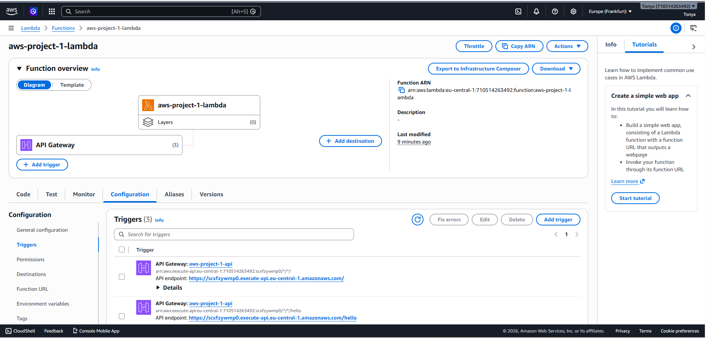
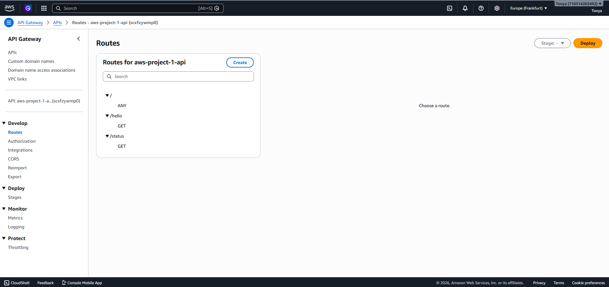
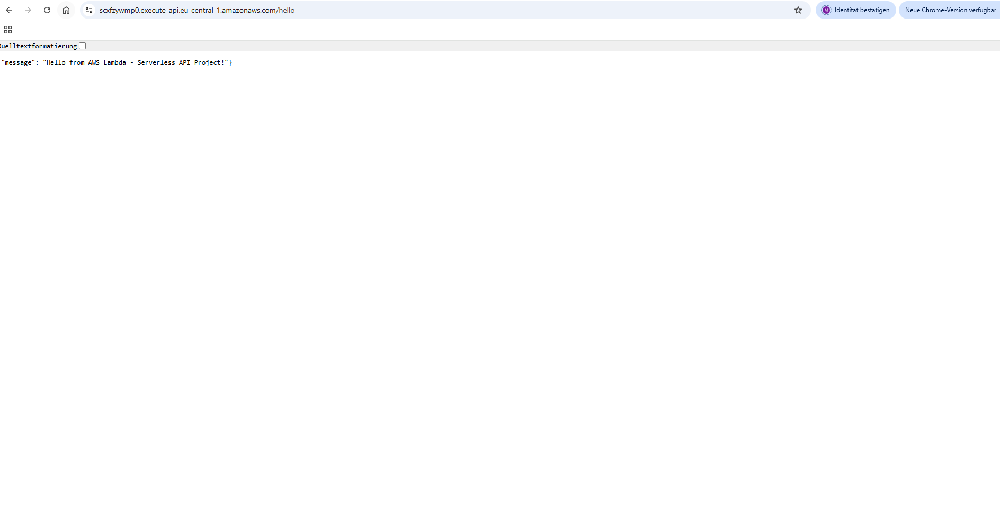
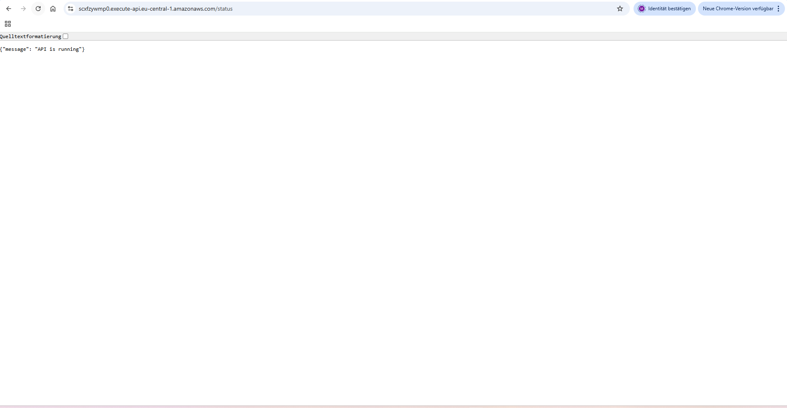

# AWS Serverless API Project

## Overview
This project is a simple serverless REST API built with AWS Lambda and API Gateway.

## Features
- GET /hello → Returns greeting message
- GET /status → Returns API health status

## Live Demo

- Hello Endpoint: https://scxfzywmp0.execute-api.eu-central-1.amazonaws.com/hello
- Status Endpoint: https://scxfzywmp0.execute-api.eu-central-1.amazonaws.com/status

## Screenshots

### AWS Lambda Architecture

### API Gateway Routes

### Hello Endpoint Response

### Status Endpoint Response

## AWS Services Used
- AWS Lambda
- API Gateway
- GitHub

## Technologies
- Python 3.x
- JSON
- REST API

## What I Learned
- Building serverless APIs with AWS Lambda
- Integrating Lambda with API Gateway
- Creating multiple API routes
- Deploying cloud projects with Git/GitHub